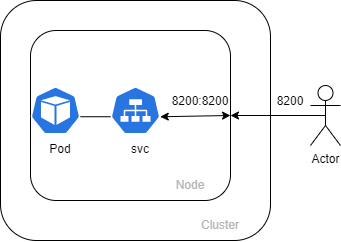
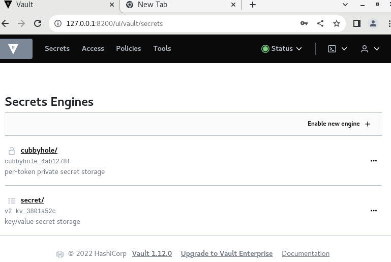
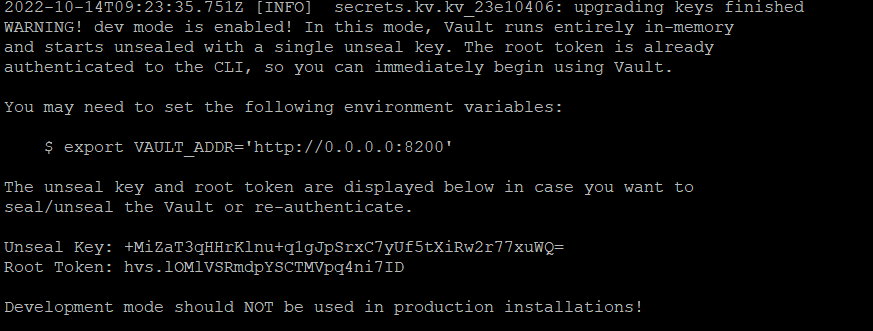

University: [ITMO University](https://itmo.ru/ru/)

Faculty: [FICT](https://fict.itmo.ru)

Course: [Introduction to distributed technologies](https://github.com/itmo-ict-faculty/introduction-to-distributed-technologies)

Year: 2022/2023

Group: K4110c

Author: Mhitaryan Sergey Armenovich

Lab: Lab1

Date of create: 09.09.2022

Date of finished: 09.09.2022

# Выполнение лабораторной работы

## Code trace

`minikube start` запуск кластера minikube

`minikube kubectl -- apply -f vault.yml` загрузка образа hashicorp vault и создание ресурса kubernetes

`minikube kubectl -- expose pod vault --type=NodePort --port=8200` создание объекта сервис, команда необходимая для того, чтобы получить доступ к поде извне

`minikube kubectl -- port-forward service/vault 8200:8200`  команда, которая прокидывает порт компьютера в контейнер 

`minikube stop`  остановка кластера

## Получение токена 

`minikube kubectl -- logs vault` Получаем токен используя эту команду

## Схема

## Расположение токена

## Результат работы

