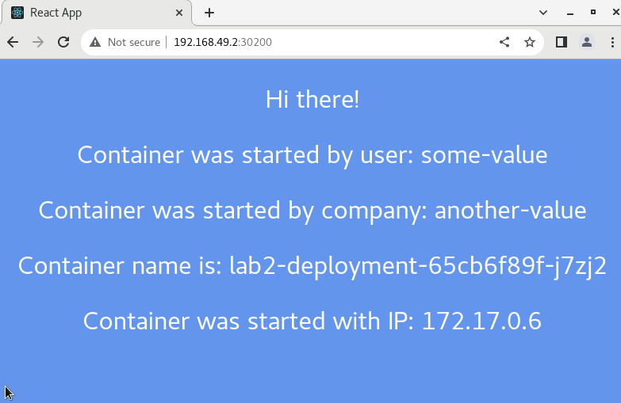
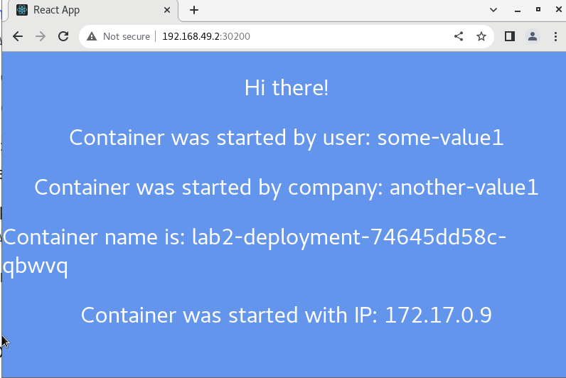
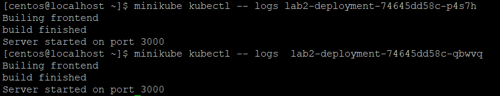
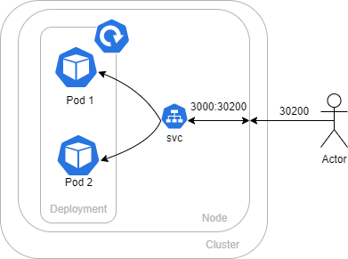

University: [ITMO University](https://itmo.ru/ru/)

Faculty: [FICT](https://fict.itmo.ru)

Course: [Introduction to distributed technologies](https://github.com/itmo-ict-faculty/introduction-to-distributed-technologies)

Year: 2022/2023

Group: K4110c

Author: Mhitaryan Sergey Armenovich

Lab: Lab2

Date of create: 20.09.2022

Date of finished: 20.09.2022

# Выполнение лабораторной работы

## Code trace


Запускаем кластер и создаем новый deployment
```bash
minikube start  
minikube kubectl -- apply -f lab2.yaml 
```
Перейдя по id node и порту можем увидить результат



Обновляем переменные и применяем изменения
```bash
minikube kubectl -- apply -f lab2.yaml 
```
Проверим, что обновления были применены и убедимся, что значения переменных поменялись



Посмотрим логи следующей командой

```bash
minikube kubectl -- logs lab2-deployment74645dd58c-p4s7h
```




## Схема 

