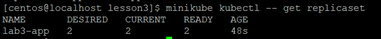
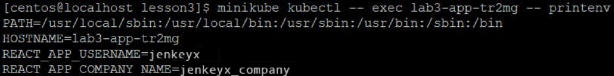
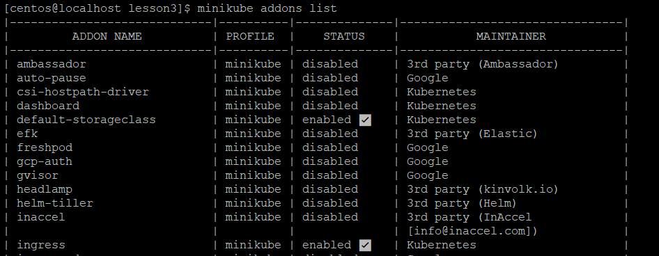
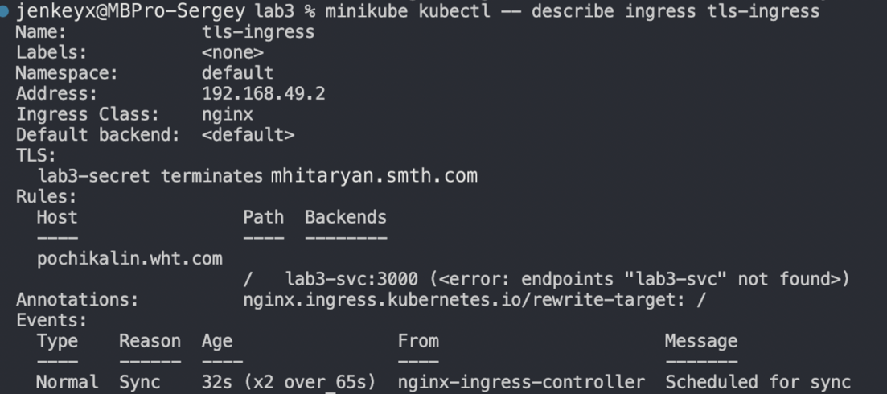
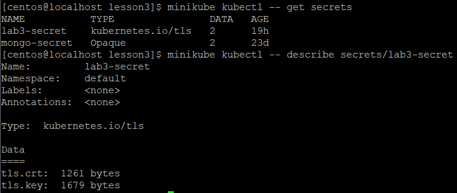
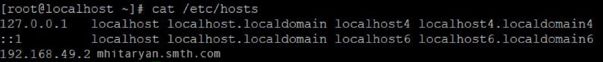
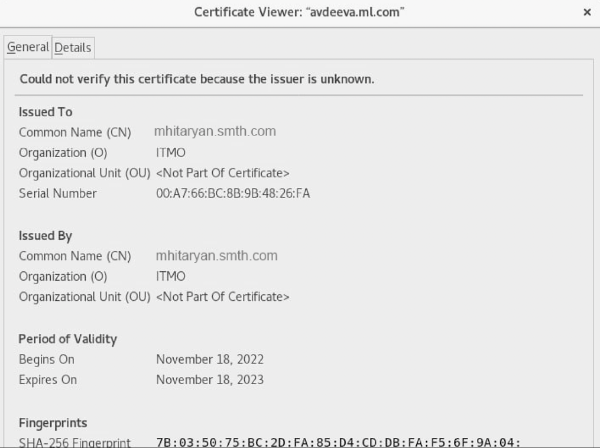
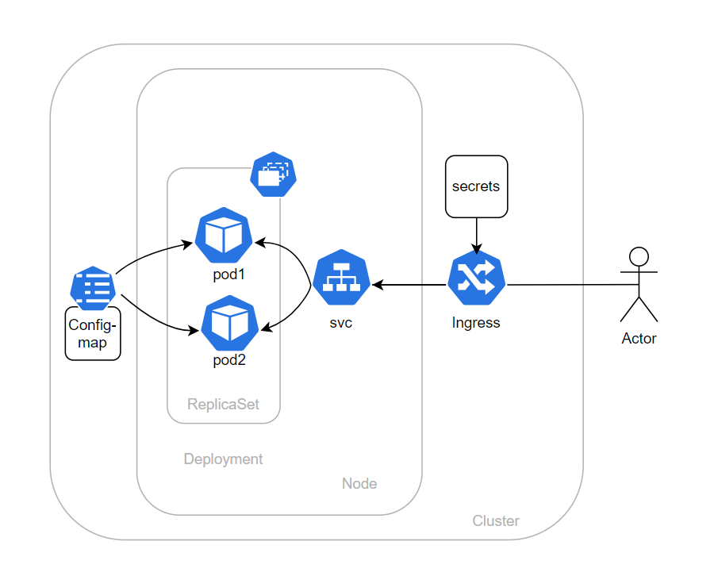

University: [ITMO University](https://itmo.ru/ru/)

Faculty: [FICT](https://fict.itmo.ru)

Course: [Introduction to distributed technologies](https://github.com/itmo-ict-faculty/introduction-to-distributed-technologies)

Year: 2022/2023

Group: K4110c

Author: Mhitaryan Sergey Armenovich

Lab: Lab3

Date of create: 18.11.2022

Date of finished: 18.11.2022


# Выполнение лабораторной работы

## Code trace

Создадим ConfigMap с переменными: REACT_APP_USERNAME, REACT_APP_COMPANY_NAME.

```bash
kubectl apply -f config-map_lab3.yaml
```

создадим replicaSet с 2 репликами контейнера ifilyaninitmo/itdt-contained-frontend:master и используя ранее созданный configMap передадим переменные REACT_APP_USERNAME, REACT_APP_COMPANY_NAME .


```bash
kubectl apply -f ReplicaSet_lab3.yaml
```

Проверим, что переменные добавлены



Создадим сервис

```bash
kubectl apply -f svc_lab3.yaml
```

Включим minikube addons enable ingress и проверим,что ingress включен

```bash
minikube addons enable ingress
minikube addons list
```


Создадим Ingress и получаем его ip

```bash
minikube kubectl -- apply -f ingress_lab3.yaml 
```

IP:



сгенерируем TLS сертификат, испольюзуя openssl


```bash
openssl genrsa -out ca.key 2048
openssl req -x509 -new -nodes -days 365 -key ca.key -out ca.crt
```
Создадим secret и добавим в него сертификат

```bash
kubectl create secret tls lab3-secret \
--key ca.key \
--cert ca.crt
```



Пропишем DNS:



Проверим сертификат



## Схема




