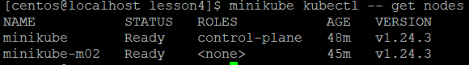
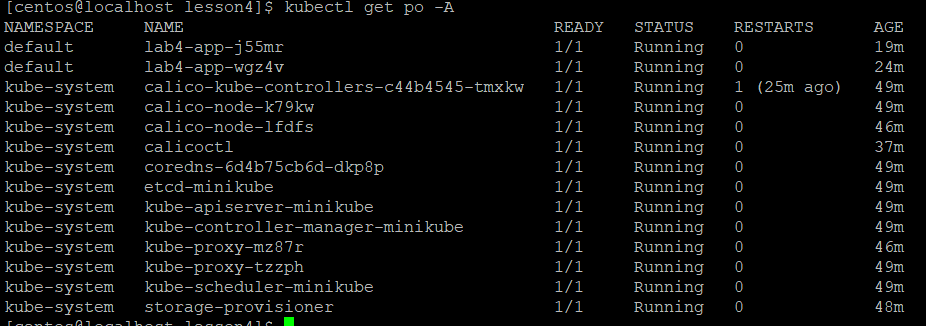
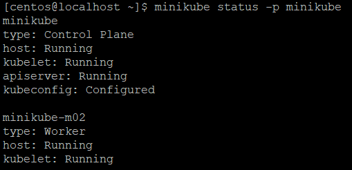
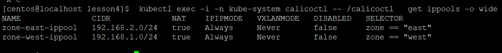
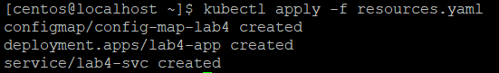
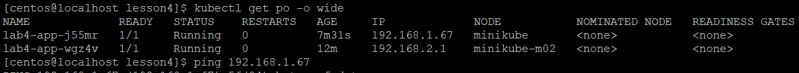
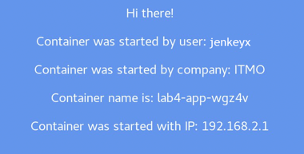
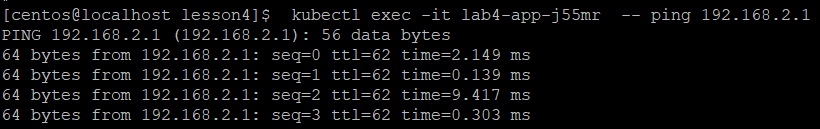
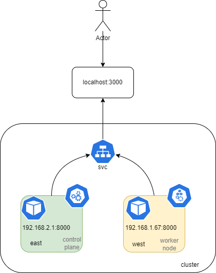

University: [ITMO University](https://itmo.ru/ru/)

Faculty: [FICT](https://fict.itmo.ru)

Course: [Introduction to distributed technologies](https://github.com/itmo-ict-faculty/introduction-to-distributed-technologies)

Year: 2022/2023

Group: K4110c

Author: Mhitaryan Sergey Armenovich

Lab: Lab4

Date of create: 11.01.2023

Date of finished: 11.01.2023

# Выполнение лабораторной работы

## Code trace

Создадим кластер minikube с 2 нодами, а также установим плагин CNI=calico 

```bash
minikube start --nodes 2 --cni calico --kubernetes-version=v1.24.3
minikube kubectl -- get nodes
```
Убедимся, что 2 ноды запущены



Проверим, что необходимые ресурсы созданы

```bash
minikube kubectl -- get po -A
```


Статус нод можно узнать, используя следующую команду:

```bash
minikube status -p minikube
```


Установим calicoctl pod, манифест скопирован с официального сайта calico:

```bash
kubectl apply -f calicoctl.yaml
```


Зададим lables для нод по географическому признаку:

```bash
kubectl label nodes minikube zone=west
kubectl label nodes minikube-m02 zone=east
```

Создадим ip pool, удалим пул по умолчанию:

```bash
kubectl exec -i -n kube-system calicoctl -- /calicoctl create -f - < ip_pool.yaml
kubectl exec -i -n kube-system calicoctl -- /calicoctl  delete ippools default-ipv4-ippool
kubectl exec -i -n kube-system calicoctl -- /calicoctl  get ippools -o wide
```


Создадим ресурсы: сервис, config map с требуемыми переменными, а также replicaset

```bash
kubectl apply -f resources.yaml
```


Пробросим порт:

```bash
kubectl port-forward service/lab4-svc 3000:8000
```
Узнаем IP адреса, полученнные подами:



и проверим, что приложение получило IP адрес из пула, заданного в конфигурационном файле:



Проверим сетевую связность, используя утилиту ping:

```bash
kubectl exec -it lab4-app-j55mr  -- ping 192.168.2.1
```


# Схема




